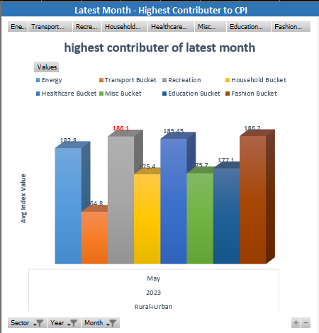
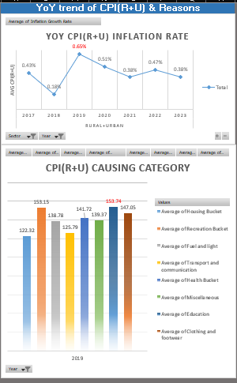
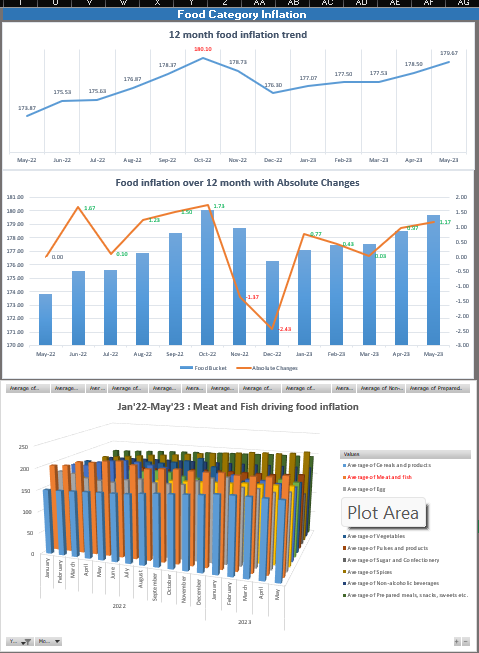
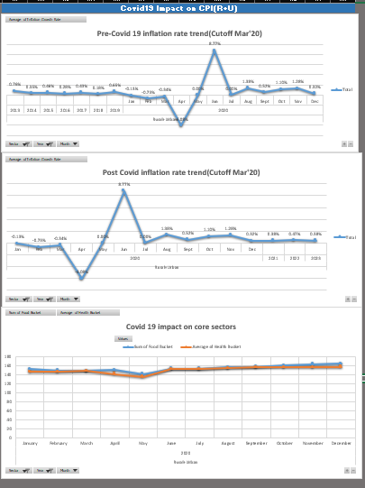
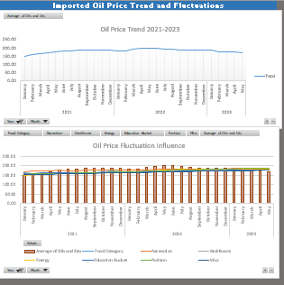

# india-cpi-case-study

## Objective
Analyzing India's CPI trends for various sectors and impact of global events like Covid 19 & global oil price fluctuations

## Source Data
link : [source dataset(uncleaned)](https://github.com/anuragnayak20/india-cpi-case-study/blob/main/All_India_Index_Upto_April23%20(1).csv)

## Analysis findings

| Focus | Findings | 
|-------|------------|
| Most contributing category for the last month | Recreational activities |
| YoY trend of CPI(Rural + Urban) & reason behind any spike | Education for 2019 caused CPI(R+U) spike |
| 12 month trend analysis of food inflation with absolute changes and causes | Meat & fish consistently high and contributed to CPI the most|
| Trend analysis of Covid 19 impact on CPI | Massive CPI uptick in Jun'20 but by Dec'20 back to pre-Covid 19 levels |
| Impact of imported oil price and global price fluctuations | Fuel,Transport,Education,Recreation & Miscellaneous affected most |

## Dashboard

